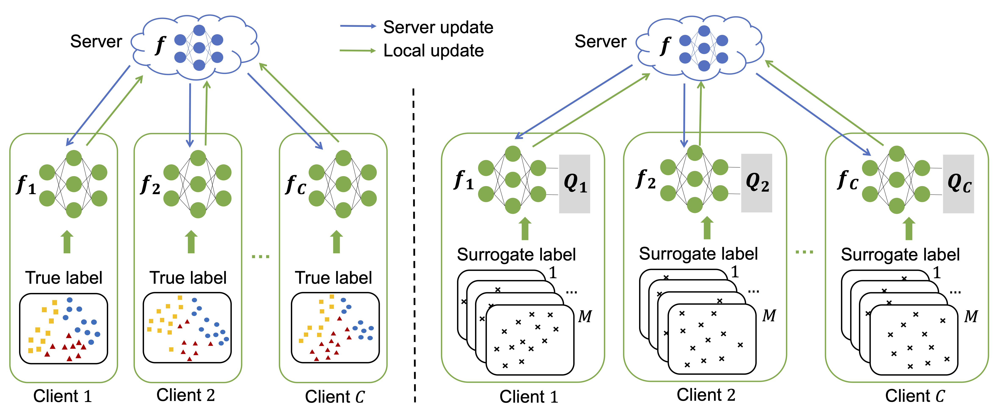

# FedUL

This is the PyTorch[1] implemention of our paper [**Federated Learning from Only Unlabeled Data with
Class-Conditional-Sharing Clients**](https://openreview.net/forum?id=WHA8009laxu)
by [Nan Lu](https://scholar.google.co.jp/citations?user=KQUQlG4AAAAJ), [Zhao Wang](https://kyfafyd.wang)
, [Xiaoxiao Li](https://xxlya.github.io/xiaoxiao), [Gang Niu](https://niug1984.github.io)
, [Qi Dou](http://www.cse.cuhk.edu.hk/~qdou), and [Masashi Sugiyama](http://www.ms.k.u-tokyo.ac.jp/sugi/index.html).

## Abatract

> Supervised *federated learning* (FL) enables multiple clients to share the trained model without sharing their labeled data. However, potential clients might even be *reluctant* to label their own data, which could limit the applicability of FL in practice. In this paper, we show the possibility of *unsupervised* FL whose model is still a classifier for predicting class labels, if the class-prior probabilities are *shifted* while the class-conditional distributions are *shared* among the *unlabeled* data owned by the clients. We propose *federation of unsupervised learning* (FedUL), where the unlabeled data are transformed into *surrogate* labeled data for each of the clients, a *modified* model is trained by supervised FL, and the *wanted* model is recovered from the modified model. FedUL is a very general solution to unsupervised FL: it is compatible with many supervised FL methods, and the recovery of the wanted model can be theoretically guaranteed as if the data have been labeled. Experiments on benchmark and real-world datasets demonstrate the effectiveness of FedUL.



## Usage

#### Setup

We suggest using Anaconda to setup environment on Linux, if you have installed anaconda, you can skip this step.

```shell
wget https://repo.anaconda.com/archive/Anaconda3-2020.11-Linux-x86_64.sh && zsh Anaconda3-2020.11-Linux-x86_64.sh
```

Then, we can install packages using provided `environment.yaml`.

```shell
cd FedUL
conda env create -f environment.yaml
conda activate fedul
```

#### Dataset

We employ two benchmark datasets (MNIST and CIFAR10) for experiments.

#### Pretrained Weights

As for size limitation, we provide the pretrained weights of our method FedUL on MNIST and CIFAR10 running with seed `0`
for directly testing, the pretrained weights can be downloaded from [Google Drive](https://drive.google.com/drive/folders/1BNGuU3OxHCdkSR1g-F80O7gQeQfpgZ4i?usp=sharing) and put in `checkpoint` directory.

```shell
cd experiments

# MNIST IID 10 sets
python ../federated/fedul_mnist.py --setnum 10 --wdecay 1e-5 --seed 0 --test
# MNIST Non-IID 10 sets
python ../federated/fedul_mnist.py --setnum 10 --wdecay 1e-5 --seed 0 --test --noniid
# MNIST IID 20 sets
python ../federated/fedul_mnist.py --setnum 20 --wdecay 5e-6 --seed 0 --test
# MNIST Non-IID 20 sets
python ../federated/fedul_mnist.py --setnum 20 --wdecay 5e-6 --seed 0 --test --noniid
# MNIST IID 40 sets
python ../federated/fedul_mnist.py --setnum 40 --wdecay 2e-6 --seed 0 --test
# MNIST Non-IID 40 sets
python ../federated/fedul_mnist.py --setnum 40 --wdecay 2e-6 --seed 0 --test --noniid
# CIFAR10 IID 10 sets
python ../federated/fedul_cifar.py --setnum 10 --wdecay 2e-5 --seed 0 --test
# CIFAR10 Non-IID 10 sets
python ../federated/fedul_cifar.py --setnum 10 --wdecay 2e-5 --seed 0 --test --noniid
# CIFAR10 IID 20 sets
python ../federated/fedul_cifar.py --setnum 20 --wdecay 1e-5 --seed 0 --test
# CIFAR10 Non-IID 20 sets
python ../federated/fedul_cifar.py --setnum 20 --wdecay 1e-5 --seed 0 --test --noniid
# CIFAR10 IID 40 sets
python ../federated/fedul_cifar.py --setnum 40 --wdecay 4e-6 --seed 0 --test
# CIFAR10 Non-IID 40 sets
python ../federated/fedul_cifar.py --setnum 40 --wdecay 4e-6 --seed 0 --test --noniid
```

#### Training

The training logs will be saved in `logs` directory and the best checkpoints will be saved in `checkpoint`
directory.

Run all experiments on MNIST and CIFAR10:

```shell
cd experiments

# IID task
python iid.py
# Non-IID task
python noniid.py
```

Obtain results in mean (std) format:

```shell
cd experiments
python get_result.py
```

If you want to run a specific experiment:

```shell
cd experiments

# FedUL MNIST IID with 10 sets
python ../federated/fedul_mnist.py --setnum 10 --wdecay 1e-5 --seed 0
# FedUL MNIST Non-IID with 10 sets
python ../federated/fedul_mnist.py --setnum 10 --wdecay 1e-5 --seed 0 --noniid
# FedUL CIFAR10 IID with 10 sets
python ../federated/fedul_cifar.py --setnum 10 --wdecay 2e-5 --seed 0
# FedUL CIFAR10 Non-IID with 10 sets
python ../federated/fedul_cifar.py --setnum 10 --wdecay 2e-5 --seed 0 --noniid
# FedPL MNIST IID with 10 sets
python ../federated/fedpl_mnist.py --setnum 10 --wdecay 1e-5 --seed 0
# FedPL MNIST Non-IID with 10 sets
python ../federated/fedpl_mnist.py --setnum 10 --wdecay 1e-5 --seed 0 --noniid
# FedPL CIFAR10 IID with 10 sets
python ../federated/fedpl_cifar.py --setnum 10 --wdecay 2e-5 --seed 0
# FedPL CIFAR10 Non-IID with 10 sets
python ../federated/fedpl_cifar.py --setnum 10 --wdecay 2e-5 --seed 0 --noniid
```

#### Test

If you want to test a specific model, just add `--test` in command:

```shell
cd experiments

# FedUL MNIST IID with 10 sets
python ../federated/fedul_mnist.py --setnum 10 --wdecay 1e-5 --seed 0 --test
# FedUL MNIST Non-IID with 10 sets
python ../federated/fedul_mnist.py --setnum 10 --wdecay 1e-5 --seed 0 --noniid --test
# FedUL CIFAR10 IID with 10 sets
python ../federated/fedul_cifar.py --setnum 10 --wdecay 2e-5 --seed 0 --test
# FedUL CIFAR10 Non-IID with 10 sets
python ../federated/fedul_cifar.py --setnum 10 --wdecay 2e-5 --seed 0 --noniid --test
# FedPL MNIST IID with 10 sets
python ../federated/fedpl_mnist.py --setnum 10 --wdecay 1e-5 --seed 0 --test
# FedPL MNIST Non-IID with 10 sets
python ../federated/fedpl_mnist.py --setnum 10 --wdecay 1e-5 --seed 0 --noniid --test
# FedPL CIFAR10 IID with 10 sets
python ../federated/fedpl_cifar.py --setnum 10 --wdecay 2e-5 --seed 0 --test
# FedPL CIFAR10 Non-IID with 10 sets
python ../federated/fedpl_cifar.py --setnum 10 --wdecay 2e-5 --seed 0 --noniid --test
```

## Citation

If you find this code useful, please cite in your research papers.

```
@inproceedings{
    lu2022unsupervised,
    title={Unsupervised Federated Learning is Possible},
    author={Nan Lu and Zhao Wang and Xiaoxiao Li and Gang Niu and Qi Dou and Masashi Sugiyama},
    booktitle={International Conference on Learning Representations},
    year={2022},
    url={https://openreview.net/forum?id=WHA8009laxu}
}
```

## Questions
For further questions, pls feel free to contact [Nan Lu](mailto:lu@edu.k.u-tokyo.ac.jp) or [Zhao Wang](mailto:zwang21@cse.cuhk.edu.hk).

## References

[1] A. Paszke, S. Gross, F. Massa, A. Lerer, J. Bradbury, G. Chanan, T. Killeen, Z. Lin, N. Gimelshein, L. Antiga *et
al.*, “Pytorch: An imperative style, high-performance deep learning library,” in *Advances in neural information
processing systems*, 2019, pp. 8026–8037.
